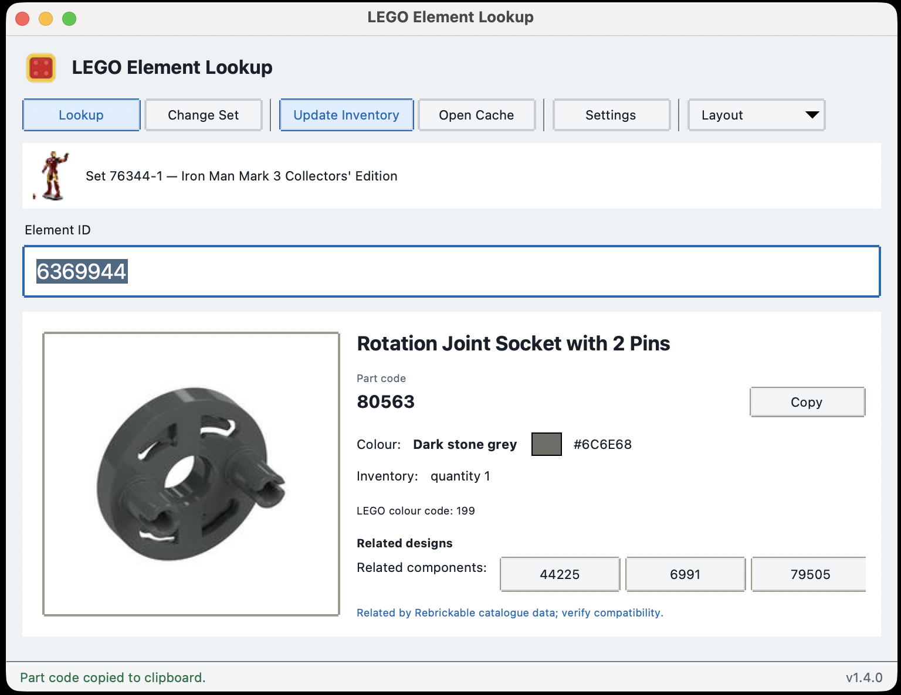
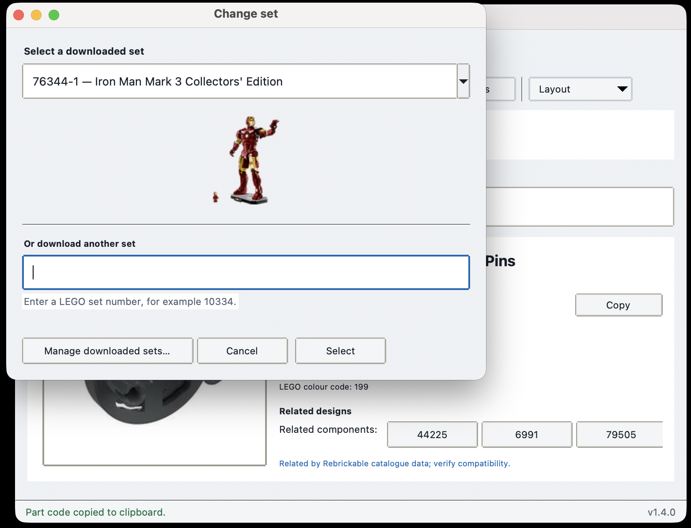
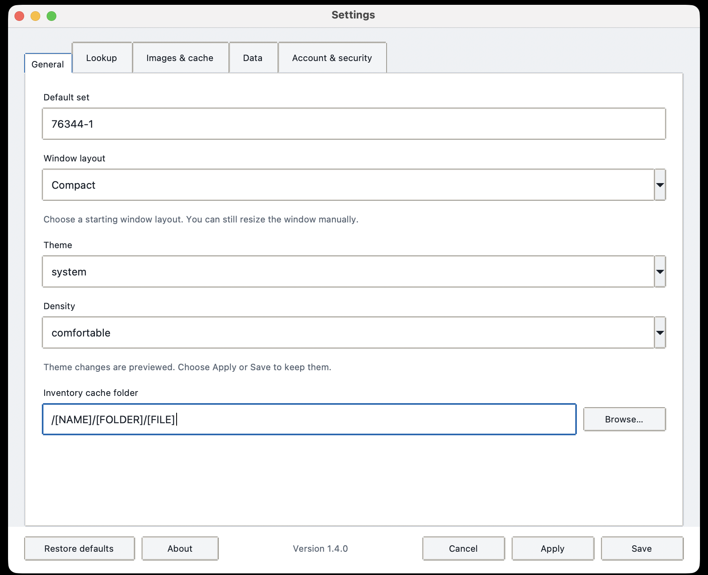

# LEGO Element Lookup

[](https://github.com/MES30004E/lego-element-lookup/actions/workflows/tests.yml)

LEGO Element Lookup is a cross-platform desktop application for identifying LEGO parts from the element IDs printed in instruction manuals. It returns the matching part code, official LEGO colour code, names, inventory quantity, preview image, and source-backed related designs.

It is designed for quick building workflows such as Mecabricks and can copy each part code automatically. Once a set inventory has been downloaded, normal lookups work offline.

Native desktop builds are available for macOS, Windows, and Linux. A command-line interface is also included for scripting and terminal workflows.



## Contents

- [Download](#download)
- [Features](#features)
- [Getting started](#getting-started)
- [Desktop application](#desktop-application)
- [Managing sets](#managing-sets)
- [Related designs](#related-designs)
- [Settings and appearance](#settings-and-appearance)
- [Security and privacy](#security-and-privacy)
- [Command-line interface](#command-line-interface)
- [Troubleshooting](#troubleshooting)
- [User file locations](#user-file-locations)
- [Current limitations](#current-limitations)
- [Roadmap](#roadmap)
- [Development](#development)

## Download

End users should download a prebuilt desktop release from [GitHub Releases](https://github.com/MES30004E/lego-element-lookup/releases). Python is already included.

| Platform | Download |
| --- | --- |
| macOS Apple Silicon | `LEGO-Element-Lookup-v1.4.1-macOS-arm64.dmg` |
| macOS Intel | `LEGO-Element-Lookup-v1.4.1-macOS-x86_64.dmg` |
| Windows 10/11 | `LEGO-Element-Lookup-v1.4.1-Windows-x86_64-Setup.exe` |
| Linux | `LEGO-Element-Lookup-v1.4.1-Linux-x86_64.AppImage` |
| Linux fallback | `LEGO-Element-Lookup-v1.4.1-Linux-x86_64.tar.gz` |

Desktop builds bundle Python. Installing from source requires Python 3.10 or newer.

## Features

### Lookup

- Convert an element ID into its part code.
- Show the official colour code, part and colour names, and inventory quantity.
- Copy the part code automatically.
- Choose the correct result when an element ID has multiple matches.

### Offline and sets

- Use downloaded inventories without a network connection.
- Download and switch between multiple sets.
- Enter ordinary set numbers such as `10334` or canonical numbers such as `10334-1`.
- Cache set metadata and thumbnails.
- Remove downloaded sets safely.

### Desktop experience

- Run on macOS, Windows, and Linux.
- Choose System, Light, or Dark appearance.
- Use responsive layouts and starting-window presets.
- Resize freely in both axes.
- Access native application menus and result-only scrolling.

### Data and previews

- Display and cache part previews.
- Review, limit, or clear the preview cache.
- Optionally download Rebrickable related-design data.

## Getting started

1. Download the app for your platform.
2. Launch LEGO Element Lookup.
3. Enter your Rebrickable API key.
4. Enter a set number such as `10334`.
5. Wait for the inventory to download.
6. Enter element IDs from the instruction manual.

Internet access is needed for downloading or updating sets and for optional remote previews or relationship data. Cached inventory lookups work offline.

## Desktop application

### First launch

The setup wizard asks for an API key from a free [Rebrickable](https://rebrickable.com/) account, a default set, and an optional cache location. It stores the key in the operating-system keychain when available. If secure storage is unavailable, the key can be retained for the current session only.

### Looking up a part

Enter an element ID and press Enter. The result shows the part code, colour code, part and colour names, quantity, colour swatch, and preview. Successful lookups can copy the part code automatically; when several matches exist, choose one before copying.

Preview images are cached after their first successful download. A missing preview does not prevent an offline inventory lookup.

### Responsive interface

The main window uses Wide, Medium, and Narrow layouts. Below 760 pixels, the preview stacks above the details and secondary commands move into an overflow menu.

Only the result region scrolls, keeping the header, set, input, and status bar visible. The main window resizes down to 640 × 560 pixels; Settings remains usable down to 720 × 600 pixels.

## Managing sets

- Enter either `10334` or `10334-1`; the app normalises the set number.
- A new set becomes active only after its inventory downloads successfully.
- Switch immediately between valid downloaded sets.
- Use cached set names and thumbnails while offline.
- Remove inventories you no longer need. Select another set before removing the active one.



## Related designs

Related-design data is optional, downloaded separately from Rebrickable, and never bundled with the application. The app displays direct, source-backed catalogue relationships only:

- Alternate designs
- Mould variants
- Decorated variants
- Related components

Cached relationship data remains available offline. Related parts are catalogue relationships, not guarantees of interchangeability.

## Settings and appearance



Settings are transactional: Apply or Save keeps changes, while Cancel discards them.

| Section | Controls |
| --- | --- |
| General | Default set, inventory cache folder, System/Light/Dark theme, Comfortable/Compact density, and Auto/Wide/Tall/Compact window layout |
| Lookup | Automatic copying, copied confirmation, input refocus, and optional result details |
| Images and cache | Part previews, set thumbnails, preview size, cache limit and eviction, and clear-cache action |
| Data | Downloaded-set management and access to the cache folder |
| Account and security | Keychain and session-only storage guidance, plus manual update-check preferences |

The System theme follows operating-system appearance changes. Manual Light or Dark selection remains fixed.

## Security and privacy

- No API key is bundled with the application or release assets.
- The key is sent only to Rebrickable when an authenticated download or update requires it.
- The desktop app uses the operating-system keychain where available and reads the stored key once per running session.
- Cached lookups do not send network requests.
- Local configuration and cache files are ignored by Git.
- Runtime diagnostics omit secrets and personal paths.

If a key is exposed, revoke it in Rebrickable and replace it immediately.

### Unsigned builds

- **macOS:** Gatekeeper may report an unidentified developer. Approve this specific app in **System Settings → Privacy & Security**; do not disable Gatekeeper globally.
- **Windows:** SmartScreen may show an Unknown Publisher warning. Confirm the filename and checksum before choosing **Run anyway**.
- **Linux:** Make the AppImage executable if necessary. If FUSE is unavailable, use the `.tar.gz` fallback.

Always compare downloads with `SHA256SUMS.txt` before bypassing an operating-system warning.

## Command-line interface

The desktop app is the recommended interface. The CLI remains available for scripting and terminal workflows.

### Source installation

Source users need:

- Python 3.10 or newer
- A free Rebrickable account and API key
- On Linux, `wl-copy`, `xclip`, or `xsel` for automatic CLI copying

The platform setup scripts create a virtual environment, install the package, create the user folders, and copy the example configuration:

```sh
# macOS
chmod +x scripts/setup-macos.sh
./scripts/setup-macos.sh

# Linux
chmod +x scripts/setup-linux.sh
./scripts/setup-linux.sh
```

On Windows PowerShell:

```powershell
Set-ExecutionPolicy -Scope Process Bypass
.\scripts\setup-windows.ps1
```

To install manually:

```sh
python3 -m venv .venv
. .venv/bin/activate                 # Windows: .venv\Scripts\Activate.ps1
python -m pip install .
```

Create your user configuration from [`config.example.json`](config.example.json), or use `REBRICKABLE_API_KEY` and `LEGO_LOOKUP_SET`. Environment variables override the configuration file. Print the active paths with:

```sh
lego-lookup config-path
lego-lookup cache-path
```

### Download and update

```sh
lego-lookup download 76344-1
lego-lookup update 76344-1
```

Downloads follow all Rebrickable result pages and replace the cache only after successful validation.

### Interactive and one-off lookup

Start the continuous prompt with no arguments:

```sh
lego-lookup
```

Use a bare element ID for one lookup, or retain the explicit form in existing scripts:

```sh
lego-lookup 6212040
lego-lookup lookup 6212040
```

The interactive prompt accepts repeated IDs. Use `q`, `quit`, `exit`, Ctrl+C, or Ctrl+D to close it.

### Colour swatches and clipboard

The CLI always prints the cached RGB hex value. ANSI true colour is used when supported; redirected output and invalid or missing RGB values use a plain fallback.

```sh
lego-lookup --no-colour 6212040
NO_COLOR=1 lego-lookup 6212040       # macOS and Linux
```

In PowerShell, set `$env:NO_COLOR=1`. macOS uses `pbcopy`, Windows uses `clip`, and Linux tries `wl-copy`, `xclip`, then `xsel`. A missing clipboard helper reports a warning without losing the lookup result.

## Troubleshooting

- **No cached inventory:** Download the set in the desktop app, or run `lego-lookup download SET-NUM` with a suffix such as `76344-1`.
- **No API key configured:** Complete first-run setup, or set `REBRICKABLE_API_KEY` for the CLI.
- **API key rejected:** Remove surrounding spaces and generate a replacement in your Rebrickable account if needed.
- **No match:** Check the selected set and the element ID printed in the instruction manual.
- **Clipboard unavailable on Linux:** Install `wl-clipboard`, `xclip`, or `xsel`; the displayed code remains available for manual copying.
- **Invalid inventory cache:** Update the set in the desktop app, or run `lego-lookup update SET-NUM`.
- **AppImage does not start:** Make it executable or use the Linux `.tar.gz` fallback when FUSE is unavailable.

## User file locations

| System | Configuration | Cache |
| --- | --- | --- |
| macOS | `~/Library/Application Support/lego-element-lookup/config.json` | `~/Library/Caches/lego-element-lookup/` |
| Windows | `%APPDATA%\lego-element-lookup\config.json` | `%LOCALAPPDATA%\lego-element-lookup\cache\` |
| Linux | `~/.config/lego-element-lookup/config.json` | `~/.cache/lego-element-lookup/` |

`XDG_CONFIG_HOME` and `XDG_CACHE_HOME` are respected on Linux. The CLI commands `config-path` and `cache-path` print the active locations.

## Current limitations

- The app does not update itself; **Check for Updates** opens GitHub Releases.
- Desktop builds are unsigned and not notarised or Authenticode-signed.
- Related-design relationships do not guarantee interchangeability.
- MOC import is not supported.
- Mecabricks project integration is not included.

## Roadmap

These are future ideas, not promised release features:

- Mecabricks integration
- MOC workflows
- Optional macOS Touch ID support
- Signed update delivery
- Optional native macOS visual effects

### Lite / Portable edition

A future lightweight edition could provide:

- A CLI-first element-ID lookup for older or low-resource systems
- Minimal dependencies, with no GUI or Pillow preview requirement by default
- A single Python script, minimal package, or portable zip
- The core offline element-ID → part-code and colour-code workflow

The Lite / Portable edition is not part of v1.4.1.

## Release history

See [CHANGELOG.md](CHANGELOG.md) for the complete version history.

## Development

```sh
python3 -m venv .venv
. .venv/bin/activate
python -m pip install -e . pytest
pytest
```

Tests use local fixtures and never contact Rebrickable. GitHub Actions runs Python 3.10–3.13 across Linux, macOS, and Windows.

Build the wheel and source archive with:

```sh
python -m pip install build
python -m build
```

## Attribution

LEGO is a trademark of the LEGO Group. LEGO Element Lookup is an independent project and is not affiliated with or endorsed by the LEGO Group. Rebrickable data remains subject to Rebrickable's terms.
